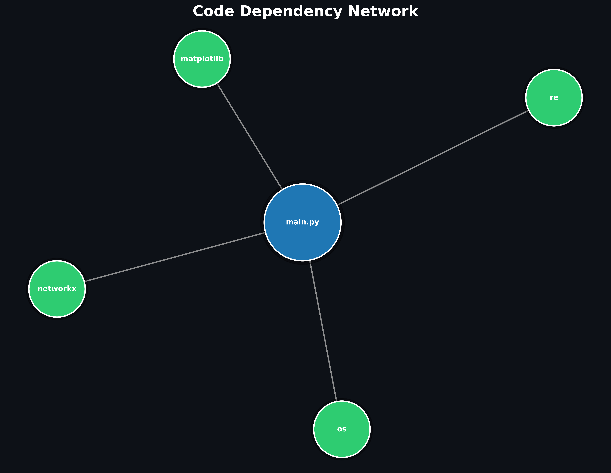

# Codebase Dependency Visualizer

A professional Python tool for analyzing software module dependencies and visualizing codebase structure through interactive and high‑resolution static graphs.

This project is designed to help developers, reviewers, and researchers quickly understand architectural relationships, identify tightly coupled modules, and assess dependency flow with clarity and precision.

---

## Executive Summary

Large codebases often become difficult to reason about due to hidden dependency chains. This tool automates dependency discovery and presents results through structured metrics and clear visualizations suitable for:

* Engineering reviews
* Architecture documentation
* Refactoring analysis
* Academic submissions
* Technical portfolios

---

## System Architecture

### Processing Pipeline

1. **File Discovery**
   Recursively scans the target directory to locate Python source files.

2. **Import Extraction**
   Parses dependency statements using pattern matching:

   * `import module`
   * `from module import object`

3. **Dependency Mapping**
   Builds a module‑to‑module relationship map.

4. **Graph Construction**
   Creates a directed graph representing dependency flow.

5. **Metric Computation**
   Calculates structural graph metrics:

   * **Out‑degree** — Number of modules a file imports
   * **In‑degree** — Number of modules that import a file

6. **Visualization Layer**

   * Interactive browser‑based graph for exploration
   * High‑resolution static graph for reports and documentation

---

## Feature Set

### Codebase Analysis

* Recursive Python file scanning
* Automatic dependency extraction
* Accurate module relationship mapping

### Structural Metrics

* In‑degree and Out‑degree computation
* Clear terminal summaries
* Automatic ranking by most dependent modules

### Interactive Visualization

* Browser‑rendered dependency network
* Zoom, pan, and drag navigation
* Physics‑based layout engine
* Clear directional relationships
* Ideal for live demos and exploration

### Static Graph Export

* High‑resolution PNG output
* Professional dark theme
* Node sizes proportional to dependency count
* Directed edges with arrows
* Suitable for publications and documentation

---

## Technology Stack

* **Python** — Core implementation
* **PyVis** — Interactive network visualization
* **NetworkX** — Graph construction and structural analysis
* **Matplotlib** — Static graph rendering

---

## Installation

```bash
pip3 install pyvis networkx matplotlib
```

---

## Usage

### Run the Analyzer

```bash
python3 main.py
```

When prompted, enter the folder path of the Python project:

```
Enter folder path: /path/to/your/project
```

### Example

```bash
python3 main.py
Enter folder path: ./my_project
```

The tool automatically analyzes the codebase and generates all outputs.

---

## Outputs

### Terminal Report

Provides a structured analytical summary:

* Dependency map
* In‑degree and Out‑degree per module
* Ranking by outgoing dependencies

### Interactive Graph

`dependency_graph.html`

Open in a browser to explore the dependency network dynamically.

### Static Graph Image

`dependency_graph.png`

High‑resolution dependency visualization with proportional node sizing and directional edges.

---

## Sample Visualization

### Static Dependency Graph (Latest Output)

The image below is generated by running the current version of the tool.

If the image does not match your latest run, regenerate it using:

```bash
python3 main.py
```



### Interactive Dependency Graph

Generated using PyVis.

Open locally after running the tool:

```bash
open dependency_graph.html
```

Capabilities:

* Zoom and pan navigation
* Draggable nodes
* Physics-based layout
* Clear dependency direction

---

## Practical Applications

* Codebase onboarding for new developers
* Software architecture reviews
* Refactoring strategy planning
* Academic research and submissions
* Technical documentation generation
* Dependency risk assessment

---

## Design Principles

* **Clarity** — Visual outputs that are easy to interpret
* **Accuracy** — Reliable dependency parsing
* **Usability** — Minimal setup and simple execution
* **Professional Presentation** — Suitable for engineering portfolios
* **Extensibility** — Designed for future analytical enhancements

---

## Performance Notes

* Efficient recursive scanning
* Lightweight dependency extraction
* Suitable for small to medium‑sized codebases
* Graph layout optimized for readability

---

## Roadmap

Planned enhancements:

* Centrality analysis for critical module detection
* Community detection for module clustering
* Import classification (standard library vs third‑party vs local)
* Command‑line argument support
* Web dashboard interface
* Large codebase performance optimization

---


## Author

Nibin Varughese Alex
M.Tech Computer Science
Focus areas: Developer tools, visualization, applied software engineering

---

## License

MIT License

